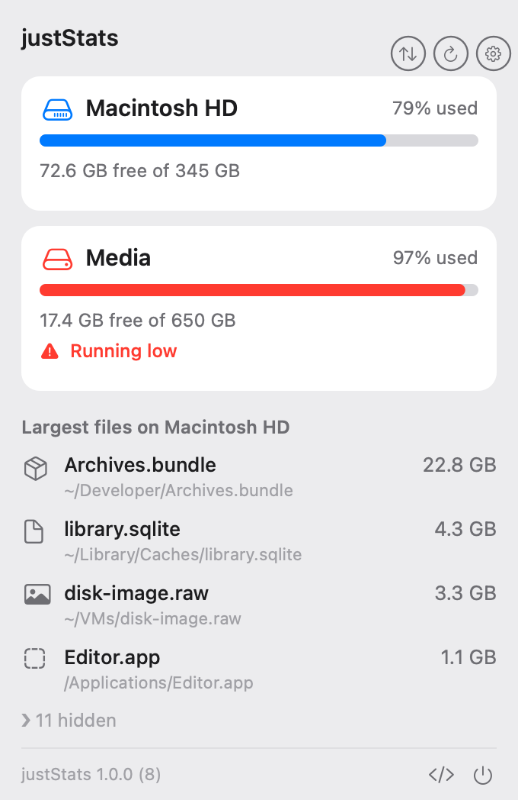
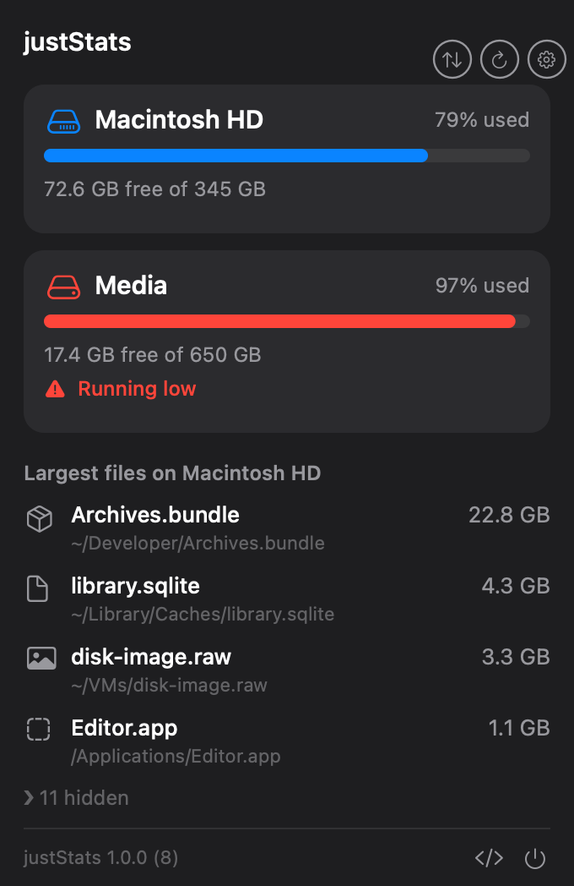

# justStats

A native macOS menu bar app that keeps an eye on your disks — at a glance, in one click.

  
  &nbsp;
  

Popover shown with example data.

## What it does

- **Status icon** in the menu bar, colored by your boot volume's free space
  (green / yellow / red) with a shape change too, so it reads without relying on
  color alone.
- **Per-volume view** in the popover: internal disks appear instantly, external
  and network volumes stream in without blocking.
- **Where your space went** — a category breakdown (System / Apps / Media / Other /
  Free) and the **largest files**, sized by what they actually use on disk.
- **Act on it** — reveal a file in Finder or move it to Trash (with a confirmation).
- **Settings** — warning/critical thresholds (GB or %), Launch at Login, ⌘, to open.
- Fast and light: about 0.0% CPU and ~10 MB when idle.

## Requirements

macOS 15 (Sequoia) or later.

## Install

The app is unsigned (no Apple Developer ID), so Gatekeeper warns you on first launch.

1. Download `justStats.zip` from [Releases](../../releases).
2. Unzip it, then **drag `justStats.app` into your Applications folder in Finder**.
   Do this by dragging in Finder — don't run it from the Downloads folder and don't
   copy it with the terminal. macOS App Translocation runs a downloaded app from a
   random read-only path until you move it in Finder, which would stop auto-update
   from working.
3. Right-click the app → **Open**, then confirm **Open**. Only needed once.
   (If macOS still refuses: System Settings → Privacy & Security → **Open Anyway**.)

Auto-update then works silently (verified) — new versions install and relaunch on
their own via Sparkle.

## Building and contributing

See [README.Dev.md](README.Dev.md) for building from source, running the tests,
the architecture, and how auto-update / releases work.

## License

MIT — see [LICENSE](LICENSE). The app bundles [Sparkle](https://github.com/sparkle-project/Sparkle)
(MIT); third-party license notices are in [THIRD-PARTY-LICENSES.md](THIRD-PARTY-LICENSES.md).
